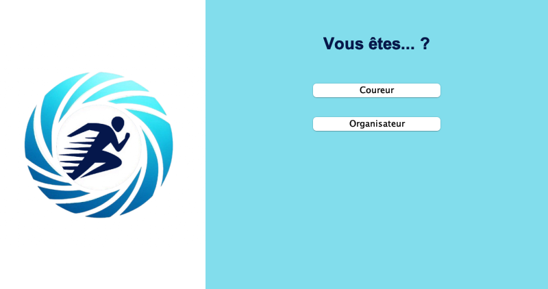
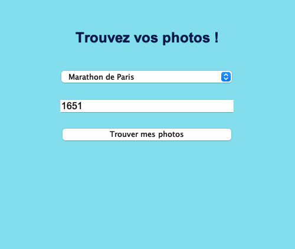
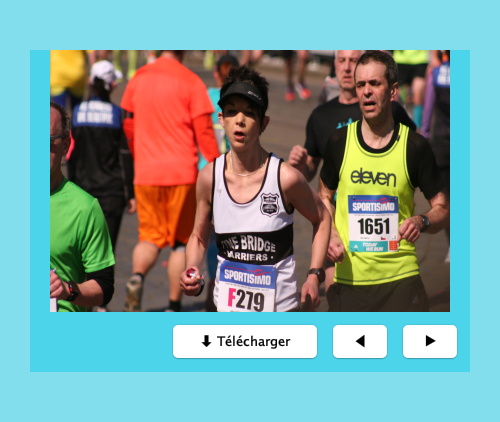
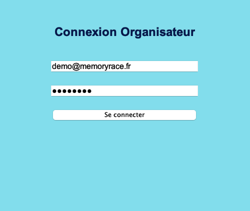
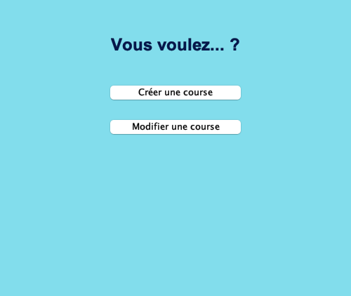
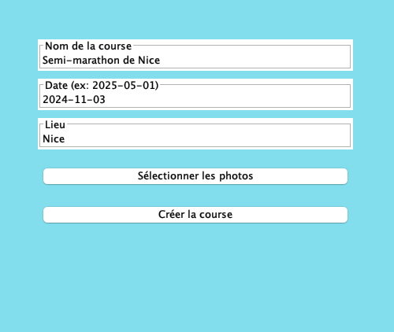
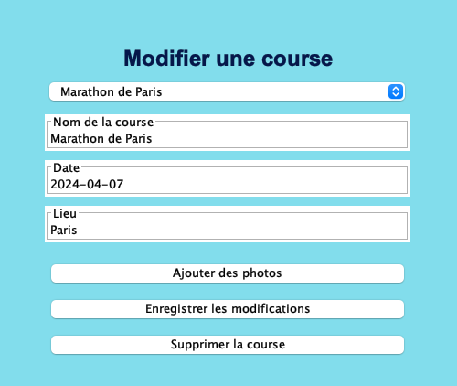
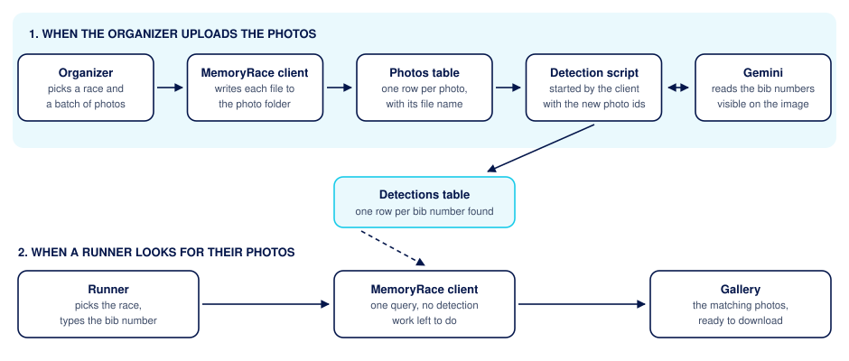

# MemoryRace

[](https://github.com/NnicolasN/MemoryRace/actions/workflows/build.yml)

MemoryRace is an application designed to simplify the identification and retrieval of race photos using bib number recognition.

It allows runners to quickly access the photos in which they appear by simply entering their bib number, eliminating the need to manually browse through large image galleries.



MemoryRace was built as a first year project (PRO3600) at Télécom SudParis.

## What it looks like

Every window keeps the same layout, the logo on the left and the current step on the right. Clicking the logo goes back to the home screen. The screenshots below are cropped to that right panel.

### Runners

| Pick the race, type the bib number | Browse the photos you appear on |
| --- | --- |
|  |  |

The search above returns bib 1651 in the Marathon de Paris. The arrows move through the results and the download button saves the photo currently on screen. Clicking the photo opens it in a larger window.

### Organizers

| Log in | Choose what to do |
| --- | --- |
|  |  |
| Create a race and upload its photos | Edit or delete an existing race |
|  |  |

Bib detection starts on its own after every upload, so the photos are searchable as soon as the upload window closes.

## Project context

During sporting events such as marathons, half marathons, or triathlons, professional and amateur photographers play a key role in capturing memorable moments of runners. These photos are not only valuable keepsakes for participants, they are also used by event organizers for promotion purposes.

Currently, these photos are often published on the official event website without any specific organization. As a result, runners must browse through large image galleries to find the photos in which they appear, which is time consuming and inefficient.

To address this issue, some events have started using systems that automatically identify photos based on a runner's bib number. While this greatly improves the user experience, such solutions are still not widely adopted.

MemoryRace aims to provide a simple, accessible and efficient solution that lets runners retrieve their photos through automated bib number recognition.

## How it works



The application has two kinds of users.

Organizers log in, create a race, then upload the photos taken during that race. Every uploaded photo is written to a shared folder and registered in the database. The application then starts a Python script that sends each new photo to a vision model, which reads the bib numbers that appear on it. Each detected number is stored as a row in the `Detections` table.

Runners pick a race in a drop down list and type their bib number. Because the detection work was already done at upload time, the search is a single database query and the matching photos show up immediately.

Two approaches were tried for the recognition itself. The first one, kept in `image_processing/prototypes/`, uses OpenCV to isolate the bib area and Tesseract to read it. It turned out to be unreliable on real race photos, where bibs are often blurry, tilted, folded or partly hidden. The version that ships uses Google Gemini instead, which handles those conditions far better.

## Repository layout

```
Application/        Java Swing client, Maven project
  src/main/java/      connectionmodel: abstract data, request and response types
                      connectionlocal: implementation talking to a local MariaDB
                      interfaceswing:  the windows of the graphical interface
  src/test/java/      JUnit 5 tests
  install.sh          prepares the photo folder, the Python venv and its dependencies
Database/           MariaDB schema, seed data and docker compose setup
  Micro_dataset/      30 annotated race photos used to evaluate the detection
image_processing/   Python side, called by the application after each upload
  prototypes/         earlier attempts, kept for reference, not used at runtime
```

The client is split in two layers on purpose. Everything in `connectionmodel` describes what the application needs without saying where the data lives, and `connectionlocal` implements that contract against a local MariaDB. Adding a remote server later means writing a second implementation rather than touching the interface.

## Quick start

You need Docker, a JDK 17 or later, Maven, Python 3 and a Google Gemini API key.

### 1. Start the database

```bash
cd Database
docker compose up -d
```

The `db` database and its tables are created automatically the first time the volume is initialized. Adminer is available on <http://localhost:8080> if you want to look at the data.

### 2. Prepare the photo folder

```bash
cd Application
./install.sh /tmp/photos
```

This creates the folder, a Python virtual environment inside it, and copies the detection script next to it. The application later runs that script from this exact location.

### 3. Give the detection script an API key

```bash
export GEMINI_API_KEY=your_key_here
```

The application passes its own environment to the Python script, so the variable has to be set in the shell you launch the application from. Database settings can be overridden the same way with `DB_HOST`, `DB_PORT`, `DB_USER` and `DB_PASSWORD`.

### 4. Build and run

```bash
cd Application
mvn clean package -DskipTests
java -jar target/standalone-jar-with-dependencies.jar /tmp/photos/
```

The photo folder path is the only argument, and it is the folder you gave to `install.sh`. A trailing slash is optional, the application adds it if it is missing.

## Test dataset

`Database/Micro_dataset/` holds 30 race photos with manually annotated bib numbers, exported from CVAT. `Database/micro_dataset.sql` turns those annotations into three fictional races ready to browse in the application:

```bash
cd Database
cp Micro_dataset/images/*.png /tmp/photos/
docker compose exec -T db mariadb -uroot -ppassword db < micro_dataset.sql
```

The organizer account that owns those races is `demo@memoryrace.fr`, password `demo`. Since the bib numbers in that file come from the human annotations, they also serve as the reference to measure how well the automatic detection performs.

## Tests

The JUnit tests exercise the database layer, so they need a running MariaDB seeded with `Database/junit.sql` and a `/tmp/junit-photos/` folder containing `Application/src/test/resources/photo.jpg`.

```bash
cd Application
mvn test
```

## Known limitations

This is a school project and a few things were left as they are once the feature set was complete.

Organizer passwords are stored and compared in clear text. The data model has a `hashedPassword` field, but nothing hashes anything yet.

Most SQL statements are built by string concatenation instead of prepared statements, which leaves the door open to SQL injection. The Python side does use prepared statements.

Photo upload runs the detection synchronously, so the interface freezes while Gemini processes a large batch.

The application only talks to a local database. There is no server, so every user needs access to the MariaDB instance and to the shared photo folder.

## Team

Alexandre Naizondard, Python and database.
Hugo Kennedy--Martinez, Python and image detection.
Nicolas Nèble, Java and graphical interface.
Nicolas Gasca, Java and database.

Project supervised by François Trahay, département INF, Télécom SudParis.

## License

MIT, see [LICENSE](LICENSE).
